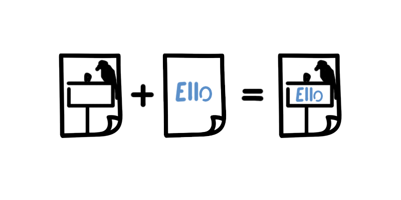
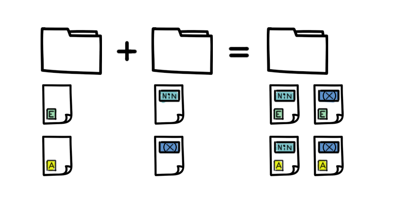

While developing [Tumblestone][1] I needed to create a lot of images. In all there were over 500 images that varied by language and platform. Creating the different versions once would have taken a while, but there was no way I was going to regenerate each image every time our strings or marketing images changed! I wrote this tool to automate the process.

What it Does
---
Imagine you need to create Steam capsule images for an upcoming sale. You've got a capsule image and some localized text to be inserted in a space in the center of each image. Using the `OverlayText` tool you can do this automatically.
<figure>
    
    <figcaption>With OverlayText you can easily combine text and images</figcaption>
</figure>

[Read the step by step OverlayText tutorial →][4]

Or perhaps your launch is approaching and you need to create end slates for the launch trailer. Your game will be launching in multiple markets and on multiple platforms, so you need end slates for every combination of platform, ratings board, and language. To be specific, if you target 3 platforms, have ratings from 3 boards, and support 8 languages then you need to create 72 images! You could brew a pot of coffee and grind through them all, or you could run `ComposeImages` and catch up on reddit.
<figure>
    
    <figcaption>With ComposeImages combining sets of images is a snap</figcaption>
</figure>

[Read the step by step ComposeImages tutorial →][5]

How It Works
---
As the name suggests the project contains a set of tools to help manage your images. To get started download the latest executable here: [{{ site.project_name }}][2]. In PowerShell or Command navigate to the exe and run:

    image-powertools
    Image Power Tools: Increase your efficiency when working with images.
      -h, -?, --help             Prints this help message.
          --tool=NAME            NAME of the tool you want to run. Valid options:

                                   OverlayText: Add text to an image inside a
                                   bounding box.

                                   ComposeImages: Combine a number of images into a
                                   single image.

By default the program prints its help. Next let's specify a tool to run:

    image-powertools --tool=OverlayText
    OverlayText: Add text to an image inside a bounding box.
    How to operate:
      -v, --verbose              All logging will be written to the console.
      -h, -?, --help             Prints this help message.
          --config=PATH          PATH to JSON configuration file.

Just like before the program printed its help. But this time the help is scoped to the tool you invoked. The final piece of the puzzle is a JSON configuration file which the tool will use in order to operate.

To learn about each tool, its configuration file, and how to use it in detail please consult the [Examples][3] included in this project. You can read detailed instructions online here:

  1. [OverlayText][4]
  1. [ComposeImages][5]

[1]: http://tumblestonegame.com
[2]: {{ site.latest_release_url }}
[3]: {{ site.project_url }}/tree/master/Examples
[4]: {{ site.project_url }}/blob/master/Examples/OverlayText/OverlayTextExample.md
[5]: {{ site.project_url }}/blob/master/Examples/ComposeImages/ComposeImagesExample.md